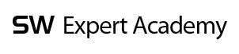

# Algorithm

> 알고리즘 문제 풀이 및 코드 관리
>
> 참고!
>
> 제가 최근에 python을 함께 공부하고 있어 Java 코드와 파이썬 코드가 같이 있을 수도 아니면 파이썬 코드만 있을 수도 있습니다.

## Environment

Language | Version | IDE
:---: | :---: | :---:
Java | JDK 11.0.1 / JDK 1.8 | Intellij / Eclipse
Python | python 3.7.x | Pycharm 

## Study Note

> 알고리즘 기초 개념 정리

[String / 문자열](edu/String.md)

## 백준 온라인 저지 (Beakjoon_Online_Judge)

  - 1065번 [한수 코드](Beakjoon_Online_Judge/hansu.py) | [문제 보기](https://www.acmicpc.net/problem/1065)

  - 1158번 [조세퍼스 문제 코드](Beakjoon_Online_Judge/josephus.py) | [문제 보기](https://www.acmicpc.net/problem/1158)

  - 2456번 (정보올림피아드 지역본선 2011 초등부/고등부) [나는 학급회장이다 코드](Beakjoon_Online_Judge/im_master.py) | [나는 학급회장이다 문제 보기](https://www.acmicpc.net/problem/2456)

  - 2563번 (정보올림피아드 2007 초등부) [색종이 코드](Beakjoon_Online_Judge/color_paper.py) | [색종이 문제 보기](https://www.acmicpc.net/problem/2563)

  - 2567번 (정보올림피아드 2007 중등부) [색종이 - 2 코드](Beakjoon_Online_Judge/color_paper_ad.py) | [색종이 - 2 문제 보기](https://www.acmicpc.net/problem/2567)

  - 2605번 (정보올림피아드 2004 초등부) [줄 세우기 코드](Beakjoon_Online_Judge/lineup.py) | [줄 세우기 문제 보기](https://www.acmicpc.net/problem/2605)

  - 7567번 [그릇 코드](Beakjoon_Online_Judge/bawl.py) | [그릇 문제 보기](https://www.acmicpc.net/problem/7567)

  - 10157번 (정보올림피아드 지역본선 2014 초등부) [자리배정 코드](Beakjoon_Online_Judge/seat_assign.py) | [자리배정 문제 보기](https://www.acmicpc.net/problem/10157)

  - 10162번 (정보올림피아드 2014 초등부) [전자레인지 코드](Beakjoon_Online_Judge/microwave.py) | [전자레인지 문제 보기](https://www.acmicpc.net/problem/10162)

  - 15961번 (정보올림피아드 지역본선 2012 중등부) [회전초밥 코드](Beakjoon_Online_Judge/sushi.py) | [회전초밥 문제 보기](https://www.acmicpc.net/problem/15961)

  - 17173번 (제3회 생각하는 프로그래밍 대회) [배수들의 합 코드](Beakjoon_Online_Judge/SumMultiple.java) | [배수들의 합 문제 보기](https://www.acmicpc.net/problem/17173)

  - 17174번 (제3회 생각하는 프로그래밍 대회) [전체 계산 횟수 코드](Beakjoon_Online_Judge/TotalCalculate.java) | [전체 계산 횟수 문제 보기](https://www.acmicpc.net/problem/17174)

  - 17175번 (제3회 생각하는 프로그래밍 대회) [피보나치는 지겨웡~ 코드](Beakjoon_Online_Judge/AnotherFibo.java) | [피보나치는 지겨웡~ 문제 보기](https://www.acmicpc.net/problem/17175)

  - 17176번 (제3회 생각하는 프로그래밍 대회) [암호해독기 코드](Beakjoon_Online_Judge/PasswordDecoder.java) | [암호해독기 문제 보기](https://www.acmicpc.net/problem/17176)

  - 17182번 (제3회 생각하는 프로그래밍 대회) [우주 탐사선 코드](Beakjoon_Online_Judge/SpaceProbe.java) | [우주 탐사선 문제 보기](https://www.acmicpc.net/problem/17182)
  
  * DP

    - 1463번 [1로 만들기](Beakjoon_Online_Judge/MakeNumberOne.java) | [문제 보기](https://www.acmicpc.net/problem/1463)

    - 11052번 [붕어빵 판매하기](Beakjoon_Online_Judge/SellingBongappang.java) | [문제 보기](https://www.acmicpc.net/problem/11052)

  * 브루트 포스

> ### 브루트 포스?
>
> 조합 가능한 모든 경우의 수를 대입하여 해답을 구하는 방식

   - 2309번 [일곱 난쟁이](Beakjoon_Online_Judge/SevenDwarfs.java) | [문제 보기](https://www.acmicpc.net/problem/2309)

  * 한국정보올림피아드 시도지역 본선

    - 지역본선 2015

      + 10799번 [쇠막대기](Beakjoon_Online_Judge/StealPipe.java) | [문제 보기](https://www.acmicpc.net/problem/10799)

## 프로그래머스 (Programmers)

  * 공채 대비 코딩테스트 실전 모의고사 2회

    - [주관적 해설 보러가기 / Java](Programmers/mock_test_second)

  * level2

    - [영어 끝말잇기 코드](Programmers/level2/EndtoEnd.java) | [문제 보기](https://programmers.co.kr/learn/courses/30/lessons/12981?language=java)

  * level3

    - [줄서는방법 코드](Programmers/level3/LineRule.java) | [문제 보기](https://programmers.co.kr/learn/courses/30/lessons/12978)

    - [배달 코드](Programmers/level3/Delevery.java) | [문제 보기](https://programmers.co.kr/learn/courses/30/lessons/12936)

    - [짝지어 제거하기](Programmers/level3/PairsRemove.java) | [문제 보기](https://programmers.co.kr/learn/courses/30/lessons/12973)

  * 2017 카카오코드 예선

    - [카카오프렌즈 컬러링북](Programmers/kakao2017/ColoringBook.java) | [문제 보기](https://programmers.co.kr/learn/courses/30/lessons/1829)

  * 코딩테스트 고득점 KIT

    [코딩테스트 고득점 KIT 보러가기](https://programmers.co.kr/learn/challenges)

    - 스택 / 큐

      + [탑](Programmers/CodingTestPractice/stackqueue/Tower.java) | [문제보기](https://programmers.co.kr/learn/courses/30/lessons/42588)

      + [프린터](Programmers/CodingTestPractice/stackqueue/Printer.java) | [문제보기](https://programmers.co.kr/learn/courses/30/lessons/42587)

      + [기능개발](Programmers/CodingTestPractice/stackqueue/FunctionDev.java) | [문제 보기](https://programmers.co.kr/learn/courses/30/lessons/42586)

      + [주식가격](Programmers/CodingTestPractice/stackqueue/StockPrice.java) | [문제 보기](https://programmers.co.kr/learn/courses/30/lessons/42584)

    - 정렬

      + [K번째수](Programmers/CodingTestPractice/sorting/KthNumber.java) | [문제 보기](https://programmers.co.kr/learn/courses/30/lessons/42748)

      + [H-Index](Programmers/CodingTestPractice/sorting/HIndex.java) | [문제 보기](https://programmers.co.kr/learn/courses/30/lessons/42747)

    - 완전 탐색

      + [모의고사](Programmers/CodingTestPractice/ExhausiveSearch/MockTest.java) | [문제 보기](https://programmers.co.kr/learn/courses/30/lessons/42840)

      + [카펫](Programmers/CodingTestPractice/ExhausiveSearch/Carpet.java) | [문제 보기](https://programmers.co.kr/learn/courses/30/lessons/42842)

     - Greedy (탐욕법)

      + [조이스틱](Programmers/CodingTestPractice/greedy/JoyStick.java) | [문제 보기](https://programmers.co.kr/learn/courses/30/lessons/42860)

      + [구명보트](Programmers/CodingTestPractice/greedy/SaveBoat.java) | [문제 보기](https://programmers.co.kr/learn/courses/30/lessons/42885)

     - DP (동적계획법)

      + [타일 장식물](Programmers/CodingTestPractice/dp/TileDeco.java) | [문제 보기](https://programmers.co.kr/learn/courses/30/lessons/43104)

      + [정수 삼각형](Programmers/CodingTestPractice/dp/IntegerTriangle.java) | [문제 보기](https://programmers.co.kr/learn/courses/30/lessons/43105)

      + [등굣길](Programmers/CodingTestPractice/dp/GoToSchool.java) | [문제 보기](https://programmers.co.kr/learn/courses/30/lessons/42898)

## SW_Expert_Academy

  * level2

    - [min max 코드 / 파이썬](SW_Expert_Academy/level2/min_max.py) | [문제 보기 - 6차시 min max](https://swexpertacademy.com/main/learn/course/subjectDetail.do?courseId=AVuPDN86AAXw5UW6&subjectId=AWOVFCzaqeUDFAWg#)

    - [숫자 카드 코드 / 파이썬](SW_Expert_Academy/level2/numbercard.py) | [문제 보기 - 8차시 숫자카드](https://swexpertacademy.com/main/learn/course/subjectDetail.do?courseId=AVuPDN86AAXw5UW6&subjectId=AWOVFCzaqeUDFAWg#)

    - [구간합 코드 / 파이썬](SW_Expert_Academy/level2/interval_sum.py) | [문제 보기 - Course List1 9차시 구간합](https://swexpertacademy.com/main/learn/course/subjectDetail.do?courseId=AVuPDN86AAXw5UW6&subjectId=AWOVFCzaqeUDFAWg#)

    - [색칠하기 코드 / 파이썬](SW_Expert_Academy/level2/coloring.py) | [문제보기 - Course List2 5차시 색칠하기](https://swexpertacademy.com/main/learn/course/lectureProblemViewer.do)

    - [이진탐색 코드 / 파이썬](SW_Expert_Academy/level2/coloring.py) | [문제보기 - Course List2 7차시 이진탐색](https://swexpertacademy.com/main/learn/course/lectureProblemViewer.do)

    - [문자열 비교 코드 / 파이썬](SW_Expert_Academy/level2/comparestr.py) | [문제보기 - Course String 3차시 문자열 비교](https://swexpertacademy.com/main/learn/course/lectureProblemViewer.do)
    
    - [회문 코드 / 파이썬](SW_Expert_Academy/level2/palindrome.py) | [문제보기 - Course String 4차시 회문](https://swexpertacademy.com/main/learn/course/lectureProblemViewer.do)
    
    - [글자수 코드 / 파이썬](SW_Expert_Academy/level2/countstr.py) | [문제보기 - Course String 5차시 글자수](https://swexpertacademy.com/main/learn/course/lectureProblemViewer.do)

    - [종이붙이기 코드 / 파이썬](SW_Expert_Academy/level2/paste_paper.py) | [문제보기 Course Stack1 6차시 종이붙이기](https://swexpertacademy.com/main/learn/course/lectureProblemViewer.do)

    - [괄호검사 코드 / 파이썬](SW_Expert_Academy/level2/check_brace.py) | [문제보기 Course Stack1 7차시 괄호검사](https://swexpertacademy.com/main/learn/course/lectureProblemViewer.do)

    - [그래프 경로 코드 / 파이썬](SW_Expert_Academy/level2/graph_path.py) | [문제보기 Course Stack1 8차시 그래프 경로](https://swexpertacademy.com/main/learn/course/lectureProblemViewer.do)

    - [반복문자 지우기 코드 / 파이썬](SW_Expert_Academy/level2/repeat_words.py) | [문제보기 Course Stack1 9차시 반복문자 지우기](https://swexpertacademy.com/main/learn/course/lectureProblemViewer.do)

    - [Forth 코드 / 파이썬](SW_Expert_Academy/level2/forth.py) | [문제보기 Course Stack2 4차시 Forth](https://swexpertacademy.com/main/learn/course/subjectDetail.do?courseId=AVuPDN86AAXw5UW6&subjectId=AWOVIc7KqfQDFAWg)

    - [미로 코드 / 파이썬](SW_Expert_Academy/level2/maze.py) | [문제보기 Course Stack2 5차시 미로](https://swexpertacademy.com/main/learn/course/subjectDetail.do?courseId=AVuPDN86AAXw5UW6&subjectId=AWOVIc7KqfQDFAWg)

    - [토너먼트 카드게임 코드 / 파이썬](SW_Expert_Academy/level2/taurnament_card.py) | [문제보기 Course Stack2 6차시 토너먼트 카드게임](https://swexpertacademy.com/main/learn/course/subjectDetail.do?courseId=AVuPDN86AAXw5UW6&subjectId=AWOVIc7KqfQDFAWg)

    - [배열 최소 합 코드 / 파이썬](SW_Expert_Academy/level2/array_min_sum.py) | [문제보기 Course Stack2 7차시 배열 최소 합](https://swexpertacademy.com/main/learn/course/subjectDetail.do?courseId=AVuPDN86AAXw5UW6&subjectId=AWOVIc7KqfQDFAWg)

  * level3

    - [전기 버스 코드 / 파이썬](SW_Expert_Academy/level3/electronic_bus.py) | [문제 보기 - Course List1 7차시 전기 버스](https://swexpertacademy.com/main/learn/course/subjectDetail.do?courseId=AVuPDN86AAXw5UW6&subjectId=AWOVFCzaqeUDFAWg#)

    - [flatten 코드 / 파이썬](SW_Expert_Academy/level3/flatten.py) | [문제 보기 - flatten](https://swexpertacademy.com/main/code/problem/problemDetail.do?contestProbId=AV139KOaABgCFAYh&categoryId=AV139KOaABgCFAYh&categoryType=CODE)

    - [View 코드 / 파이썬](SW_Expert_Academy/level3/view.py) | [View 코드 / 자바](SW_Expert_Academy/level3/View.java) | [문제 보기](https://swexpertacademy.com/main/code/problem/problemDetail.do?contestProbId=AV134DPqAA8CFAYh&categoryId=AV134DPqAA8CFAYh&categoryType=CODE)

    - [Sum 코드 / 파이썬](SW_Expert_Academy/level3/sum.py) | [문제보기](https://swexpertacademy.com/main/code/problem/problemDetail.do?contestProbId=AV13_BWKACUCFAYh&categoryId=AV13_BWKACUCFAYh&categoryType=CODE)

    - [부분집합의 합 / 파이썬](SW_Expert_Academy/level3/subset_sum.py) | [문제보기 - Course List2 6차시 부분집합의 합](https://swexpertacademy.com/main/learn/course/lectureProblemViewer.do)

    - [특별한 정렬 / 파이썬](SW_Expert_Academy/level3/special_sort.py) | [문제보기 - Course List2 8차시 특별한 정렬](https://swexpertacademy.com/main/learn/course/lectureProblemViewer.do)

    - [GNS / 파이썬](SW_Expert_Academy/level3/gns.py) | [문제보기 - 1221. GNS](https://swexpertacademy.com/main/code/problem/problemDetail.do?contestProbId=AV14jJh6ACYCFAYD&categoryId=AV14jJh6ACYCFAYD&categoryType=CODE)

    - [회문2 / 파이썬](SW_Expert_Academy/level3/palindrome2.py) | [문제보기 - 1216. 회문2](https://www.swexpertacademy.com/main/code/problem/problemDetail.do?contestProbId=AV14Rq5aABUCFAYi&categoryId=AV14Rq5aABUCFAYi&categoryType=CODE)
 
    - [Magnetic / 파이썬](SW_Expert_Academy/level3/magnetic.py) | [문제보기 - 1220. Magnetic](https://swexpertacademy.com/main/code/problem/problemDetail.do?contestProbId=AV14hwZqABsCFAYD&categoryId=AV14hwZqABsCFAYD&categoryType=CODE)

  * level4

    - [ladder1 / 파이썬](SW_Expert_Academy/level4/ladder1.py) | [문제보기 - 1219. ladder1](https://swexpertacademy.com/main/talk/solvingClub/problemView.do?solveclubId=AWhKdvi6ECkDFAS6&contestProbId=AV14ABYKADACFAYh&probBoxId=AWjbeWOaGo0DFAQn&type=PROBLEM&problemBoxTitle=2%EC%9B%94+11%EC%9D%BC&problemBoxCnt=1)

    - [성수의 프로그래밍 강좌 시청 / 파이썬]() | [문제보기 - 6719. 성수의 프로그래밍 강좌 시청](https://swexpertacademy.com/main/code/problem/problemDetail.do?contestProbId=AWd7sgDatsMDFAUh&categoryId=AWd7sgDatsMDFAUh&categoryType=CODE)

  * level5

    - [초보자를 위한 점프대 배치하기 코드](SW_Expert_Academy/level5/JumpEquipment.java) | [문제 보기](https://www.swexpertacademy.com/main/code/problem/problemDetail.do?contestProbId=AWGsV8IaAXsDFAVW&categoryId=AWGsV8IaAXsDFAVW&categoryType=CODE&&&)

    - [금속막대 코드 / 파이썬](SW_Expert_Academy/level5/stealstick.py) | [문제보기 - 1259. 금속막대](https://swexpertacademy.com/main/code/problem/problemDetail.do?contestProbId=AV18NaZqIt8CFAZN&categoryId=AV18NaZqIt8CFAZN&categoryType=CODE)

  * level6

    - [작업순서 코드 / 파이썬](SW_Expert_Academy/level6/work_order.py) | [문제보기 - 1267. 작업순서](https://swexpertacademy.com/main/code/problem/problemDetail.do?contestProbId=AV18TrIqIwUCFAZN&categoryId=AV18TrIqIwUCFAZN&categoryType=CODE)

## Algospot Online Judge

  * 초보용 문제

    - [URI 코드](Algospot/Beginner/URIDecoding.java) | [문제 보기](https://algospot.com/judge/problem/read/URI)

  * 동적계획법 (Dynamic Programming)

    - [Coin Change 코드](Algospot/Beginner/dp/CoinChange.java) | [문제 보기](https://algospot.com/judge/problem/read/COINS)

    - [Best Path On a Diamond 코드](Algospot/Beginner/dp/DiamondPath.java) | [문제 보기](https://algospot.com/judge/problem/read/DIAMONDPATH)
