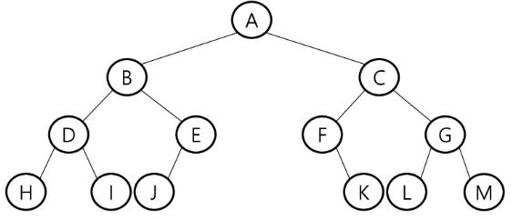

# Tree ( 트리 )

트리는 지금까지 봐왔던 리스트, 큐, 스택과는 달리 비선형구조의 자료구조이다.

원소들 간에 `1:n` 관계를 가지는 자료구조로 계층관계를 가진다.
즉. 상위 원소에서 하위 원소로 내려가면서 확장되는 트리모양의 구조이다.

트리는 주로 `일차원 배열` / `이차원 배열`로 표현하여 사용한다.

## Tree의 특징

- 하나 이상의 노드로 이뤄진 유한 집합이다.

    노드 중 최상위 노드를 루트(`root`)라고 부른다.
    나머지 노드들은 n개의 집합으로 분리될 수 있다.
    
    분리집합들은 각각의 트리가 되며 루트의 부트리(`subtree`)라고 부른다.
    
- 용어정리

    1. Node (노드) : 트리의 원소
    2. Edge (간선) : Node를 연결하는 선 (부모 노드와 자식 노드를 연결)
    3. root Node (루트 노드) : 트리의 시작 노드
    4. sibling Node (형제 노드) : 같은 부모 노드들의 자식 노드들
    5. 조상 노드 : 간선을 따라 루트까지 이르는 경로에 있는 모든 노드
    6. subtree (부트리) : 부모 노드와 연결된 간선을 끊었을 때 생성되는 트리
    7. 자손 노드 : 서브 트리에 있는 하위 레벨의 노드들
    8. Degree (차수)
        - 노드의 차수 : 노드에 연결된 자식 노드의 수
        - 트리의 차수 : 트리에 있는 노드의 차수 중에서 가장 큰 값
        - leaf node : 차수가 0인 노드 (자식 노드가 없는 노드)
        > 그래프에서는 해당 노드의 간선 개수가 차수가 된다.
    9. 높이
        - 노드의 높이 : 루트에서 노드에 이르는 간선의 수 (노드의 레벨)
        - 트리의 높이 : 트리에 있는 노드의 높이 중 가장 큰 값
       
## 이진 트리 (Binary Tree)

모든 노드들이 2개의 서브트리를 가지는 트리

- 이진 트리의 특성

레벨 i에서 노드의 최대 갯수는 2<sup>i</sup>
높이가 h인 이진 트리가 가질 수 있는 노드의 최소 갯수는 `h+1`, 최대 갯수는 2<sup>h+1</sup> - 1이다.

- 이진 트리의 종류

    1. 포화 이진 트리 (Full Binary Tree)
    
        모든 레벨에 노드가 가득 차 있는 이진트리.
        높이가 h일 때 최대의 노드 갯수인 2<sup>h+1</sup> - 1 개의 노드를 가진 이진 트리
        즉, 모든 레벨에 노드가 가득 차있는 트리
        
    2. 완전 이진 트리 (Complete Binary Tree)
    
        높이가 h이고 노드의 수가 n일 때, n번까지 순서대로 빈 자리가 없는 이진 트리
        
    3. 편향 이진 트리 (Skewed Binary Tree)
    
        높이 h에 대한 최소 개수의 노드를 가지면서 한쪽 방향의 자식 노드만을 가지는 이진 트리
        떄문에 1:1 관계의 자료구조인 `배열/리스트`와 별 차이가 없다.
        
        `왼쪽 편향 이진 트리`와 `오른쪽 편향 이진 트리`가 있다.
        
## 순회 (traversal)
 
트리의 각 노드를 중복되지 않게 전부 방문하는 방법.
트리는 비선형구조이므로 선형구조와 달리 선후 연결관계를 알 수 없으므로 특별한 방법인 `순회`를 사용해햐한다.

### 순회의 방법

- 전위순회(`preorder`) : 부모 노드를 먼저 방문한 후 왼쪽, 오른쪽 노드를 방문하는 순회 방법
- 중위순회(`preorder`) : 왼쪽 노드, 부모노드, 오른쪽 노드 순으로 방문하는 순회 방법
- 후위순회(`preorder`) : 왼쪽, 오른쪽 노드를 먼저 방문한 후 부모노드를 순회 방법



```
전위순회 : A B D H I E J C F K G L M
중위순회 : H D I B J E A F K C L G M
후위순회 : H I D J E B K F L M G C A
```

## 이진트리의 표현

이진 트리를 표현하는 방법으로는 `배열`과 `연결 리스트` 2가지 방법이 있다.

## ※ 해쉬

비교없이 `O(1)`의 `overhead`로 원하는 값을 가져오는 방법

이때 제일 중요한 것이 해쉬값을 만드는 해쉬 함수를 만드는 것이다!

> 해쉬함수의 기본적인 형태로 제법(n으로 나눈 값의 나머지를 해쉬로 사용)이 있다.

해쉬 충돌을 막는 방법

1. 바로 뒤 빈 공간에 저장
2. chaining을 통해 해당 주소에 추가 저장

## ※ 힙 (heap)

**완전 이진 트리**에 있는 노드 중에서 키값이 가장 큰 노드나 키값이 가장 작은 노드를 찾기 위해 만든 자료구조

- 최대 힙 (max heap)

키값이 가장 큰 노드를 찾기 위한 완전 이진 트리로 루트에는 키값이 가장 큰 노드가 들어가게 된다.
또한 부모 노드의 값이 자식 노드의 값보다 항상 커야한다.

- 최소 힙 (min heap)

키값이 가장 작은 노드를 찾기 위한 완전 이진 트리로 루트에는 키값이 가장 작은 노드가 들어가게 된다.
또한 부모 노드의 값이 자식 노드의 값보다 항상 작아야한다.

또한 힙은 키 값을 우선순위로 활용하여 **우선순위 큐**로 사용할 수 있다.


